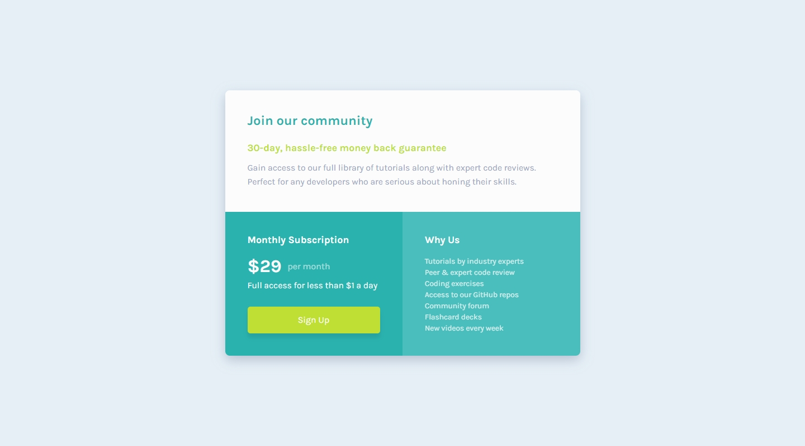

## Frontend Mentor Challenge 03 - Single Price Grid Component

This is a solution to the [Single price grid component challenge on Frontend Mentor](https://www.frontendmentor.io/challenges/single-price-grid-component-5ce41129d0ff452fec5abbbc). Frontend Mentor challenges help you improve your coding skills by building realistic projects.

### Screenshots of my solution

#

### Links
- Live Site URL: https://single-price-grid-component-darkstarxdd.vercel.app/
- Solution URL: https://www.frontendmentor.io/solutions/single-price-grid-component-j3V4R66xnd
#

### Built with
- HTML5 / CSS
- CSS Flexbox
- CSS Grid
#

### New things I learned
- Use cases of `grid-template-rows`, `grid-template-columns`, `grid-row` & `grid-column` properties.
#

- My Frontend Mentor Profile - [@DarkstarXDD](https://www.frontendmentor.io/profile/DarkstarXDD)
